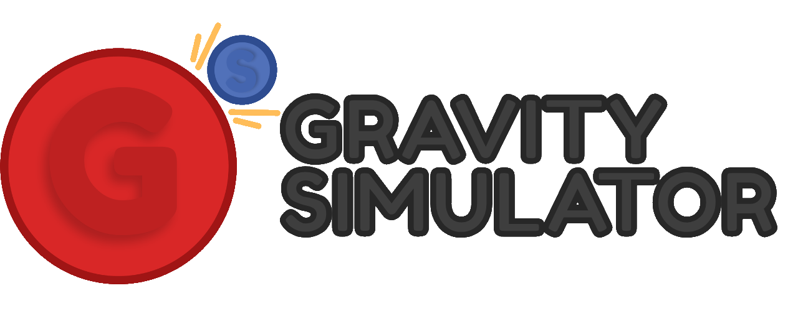
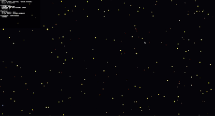
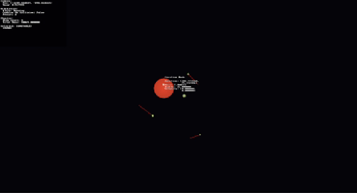

## A newtonian gravity simulator rendered in 2D using the SDL3 framework.

## Features
- Newtonian Gravity
- Camera Movement
- Colored Bodies by Mass
- Two Collision Types:
  - Bounce
  - Combine
- Body Creation
- Preset Loader
- Body Selection [UNSTABLE]

## Controls
Normal Mode:
- WASD : Camera movement
- Q/E : Camera zoom
- SPACE : Pause simulation
- RIGHT MOUSE : Select body [UNSTABLE]
- LEFT/RIGHT ARROW : Switch presets
- ESCAPE : Quit program
- C : Enter/Leave creation mode

Creation Mode:
- W/S : Switch options
- A/D : Change value
- ENTER : Spawn body

## Building

Built using Visual Studio 26 Insider Edition.
SDL3 is included with this project.

1. Clone the repository
2. Download SDL3 and copy `lib` folder to `external/SDL3`
3. Open `GravitySim.slnx` in Visual Studio
4. Build the solution
5. Run the executable

## Additional Notes

This project is still ongoing (though slowly) so some bugs may still be present in the current build.
